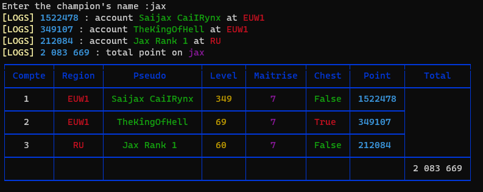

#

# Riot Games API

Welcome, this script will list how many Chest points you have on a champion with a total at the end if you have more than one league of legends account, it will show you if you have already obtained a Chest on the champion with the level of mastery of the champion.



- Riot Games Developer Portal: [https://developer.riotgames.com/](https://developer.riotgames.com/) for get API Key

**Use this command to install packages**

```
  npm install
```

**Use this command to run the script**

```
  node main.js
```
